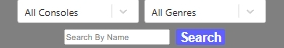
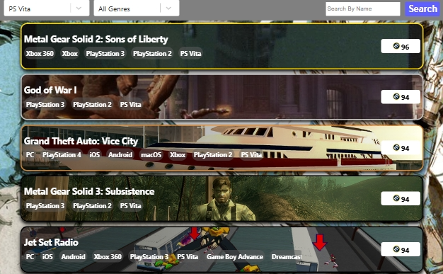
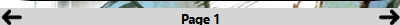

<h1>Video Game Database (RAWG API)</h1>

A video game discovery platform built in <strong>React</strong> using the <strong>RAWG Video Game Database API</strong>. This app allows users to search, filter, and explore games across multiple consoles and genres, displaying detailed game pages with dynamic visuals and ranking them by Metacritic score.  
All searches and preferences are saved using <strong>Local Storage</strong> for a seamless return experience.

<ul>
  <li>Built with React</li>
  <li>Connected to RAWG API for real-time game data</li>
  <li>Search by title, console, or genre</li>
  <li>Games ranked by Metacritic score for best-first browsing</li>
  <li>Dynamic page backgrounds based on selected game</li>
  <li>Local Storage used to save last search on reload</li>
  <li>Clickable game pages with detailed stats, genres, platforms, and release info</li>
  <li>Ranks Top 3 games by using Gold, Silver, Bronze borders on searches first page</li>
  <li>Built in pagnitation</li>
</ul>

<h2>Deployed On Netlify – <a href="[https://your-live-link-here.com/](https://poetic-rabanadas-1d8116.netlify.app/)">Video Game Database</a></h2>

<a href="https://poetic-rabanadas-1d8116.netlify.app/">Visit the Site</a>

Search by name, genre, or console using the search bar fixed to the top of every page.

 

 

 

Sorts games by metacritic score to get the best games first, with game 1-3 being bordered in a gold, silver, or bronze border. You can go deeper down the list using the pagnitation at the bottom of the page.

 

 
Each game in the sorted list has its own individual page. Each game page has its own unqique details like game description, platforms, game genre, release date, and developer/publisher. The game page also has its own dynamic gmae background to represent the selected game

<h2>Tech Used</h2>
<ul>
  <li>HTML</li>
  <li>CSS</li>
  <li>JavaScript</li>
  <li>React</li>
  <li>RAWG API</li>
  <li>Local Storage</li>
</ul>

<h2>About Me</h2>
Thank you for checking out my work — I hope you enjoyed exploring this project!
I’m currently seeking new opportunities in Web Development and would love to connect.
 

My Links: 
<a href="mailto:austintorres578@gmail.com">austintorres578@gmail.com</a> 
<a href="https://austintorres578.github.io/Web-dev-portfolio/">Portfolio Site</a> 
<a href="https://github.com/austintorres578">GitHub</a> 
<a href="https://www.linkedin.com/in/austin-torres-55696420a/">LinkedIn</a> 
